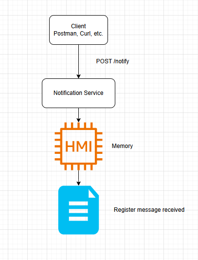

<h1> REAL-TIME NOTIFICATIONS SERVICE

## Overview
This is a simple solution developed with TypeScript. Its function is to accept notifications, queue them in memory and simulate the delivery by logging the details to a file.

## Features
* Accepts notification requests via a REST API.

* Uses an in-memory queue to process notifications asynchronously.

* Logs notification details (recipient ID, notification type, and message content) to a file instead of the actual delivery.

* Provides integration testing with Jest and Supertest.

## Prerequisites
- **[Node.js](https://nodejs.org/)** (version 20 or later)           

- **[NPM](https://www.npmjs.com/)**

## Installation

Clone the repository and install dependencies:

~~~sh
git clone <repository-url>
cd real-time-notification-service
npm install
~~~

### Running the Service

To start the server:

~~~sh
npm start
~~~

The service will be available at **`http://localhost:3000`**

## API Usage

### Send a Notification
You can test the Api using **Postman** or via the command line with `curl`.

#### Option 1: Using Postman
1. Open **Postman**.
2. Create a **new request** with:
   - **Method:** `POST`
   - **URL:** `http://localhost:3000/notify`
   - **Body:** Select **raw** and choose **JSON** format.
3. Use the following request body:
~~~json
{
  "recipientId": "087668776",
  "notificationType": "message",
  "content": "Your order is on delivery route"
}
~~~
4. Click *Send*.

- ✅ As successfull request returns **`202 Accepted`**.
- ❌ If required fields are missing, it returns **`400 Bad Request`**.
  
*Option 2: Using Curl (Command Line)*
Run the follouing command in your terminal:
~~~sh
curl -X POST http://localhost:3000/notify \
     -H "Content-Type: application/json" \
     -d '{"recipientId": "087668776", "notificationType": "message", "content": "Your order is on delivery route!"}'
~~~

## Running Tests

Run integration tests with Jest:

~~~sh
npm test
~~~


## Project Structure

```
real-time-notification-service/
├── src/
│   ├── index.ts        # Main server file
├── tests/
│   ├── index.test.ts   # Integration tests
├── package.json
├── tsconfig.json
├── README.md           # Project documentation
```
_______________________________ 
<br>
<br>

# Strategies for Scaling the Service

Several strategies can be implemented to scale this service, and the expected growth level will help determine the best approach.

### 1️⃣ Use a Message Queue
This project currently uses an in-memory queue, but this limits scalability. An external messaging system can be used to distribute notifications among multiple workers. (e. g., Redis, RabbitMQ, or Kafka)

### 2️⃣ Resource Scaling
- Improve the server where the application is hosted by increasing CPU, memory, and disk.
- Attention point: This approach has physical limits and does not solve high demand in the long term.

### 3️⃣ Multiple Instances
- Run multiple instances of the service on different servers. A Load Balancer can be used to distribute the traffic (e.g., Nginx).

### 4️⃣ Database instead of In-Memory Queues
- A database can be used to persist notifications before processing, ensuring message integrity, as in-memory queues can be lost if the server is restarted.

### 5️⃣ Microservices instead of Monolith
Microservices can also be considered. 

### 🔨 Conclusion
The service can be divided into independent microservices, where an API Gateway handles requests, a Worker Service processes asynchronous notifications, and a Database Service manages the notification statuses, allowing for separate scalability, better maintenance, independent deployments, and greater fault tolerance.

## Simple diagram archtecture


## License
This project is open-source and available under the MIT License.
____
 

 


          